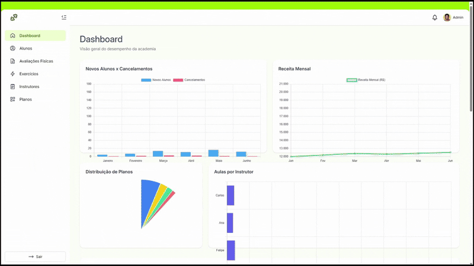

# 💪 MyBody Admin

MyBody Admin é uma aplicação web desenvolvida para gerenciamento de academia, criada como parte de um projeto universitário da disciplina de Banco de Dados.

## Tecnologias utilizadas

- Vue.js w/ Typescript
- Nest.js w/ TypeORM
- SQL Server

## Como rodar o projeto

1. Clone o repositório
2. Instale as dependências das duas pastas **client** e **server**
3. Execute o comando `npm run dev`
4. Acesse o link `http://localhost:5173` no navegador
   
---
